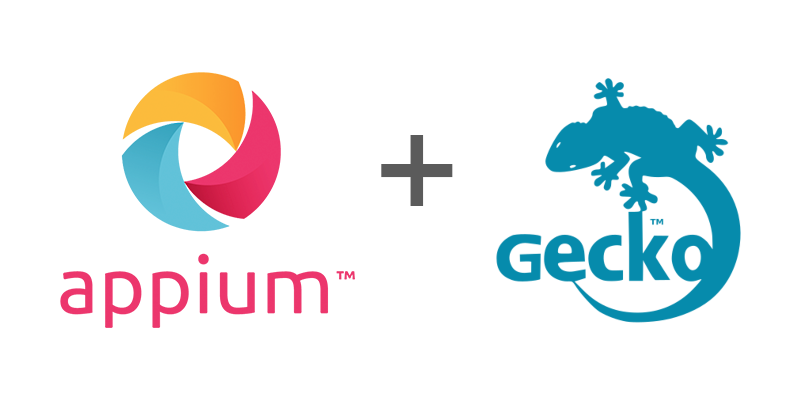

## Appium Geckodriver

   

---

<b>
   <a href="https://appium.github.io/appium-geckodriver/">Documentation</a> |
   <a href="https://appium.github.io/appium-geckodriver/latest/getting-started/">Get Started</a> |
   <a href="https://github.com/appium/appium-geckodriver/blob/master/CHANGELOG.md">Changelog</a>
</b>

---

This is Appium driver for automating Gecko-based browsers (such as Firefox) and webviews on different
platforms, including Android.

> [!IMPORTANT]
> Since major version *2.0.0*, this driver is only compatible with Appium 3.

## Documentation

You can access the documentation here: [**https://appium.github.io/appium-geckodriver**](https://appium.github.io/appium-geckodriver)
